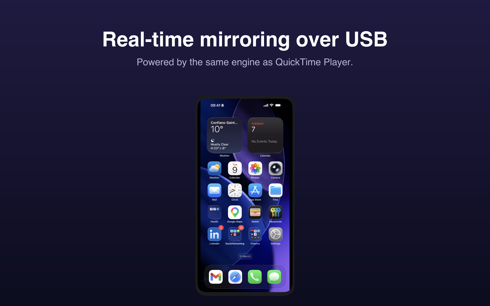
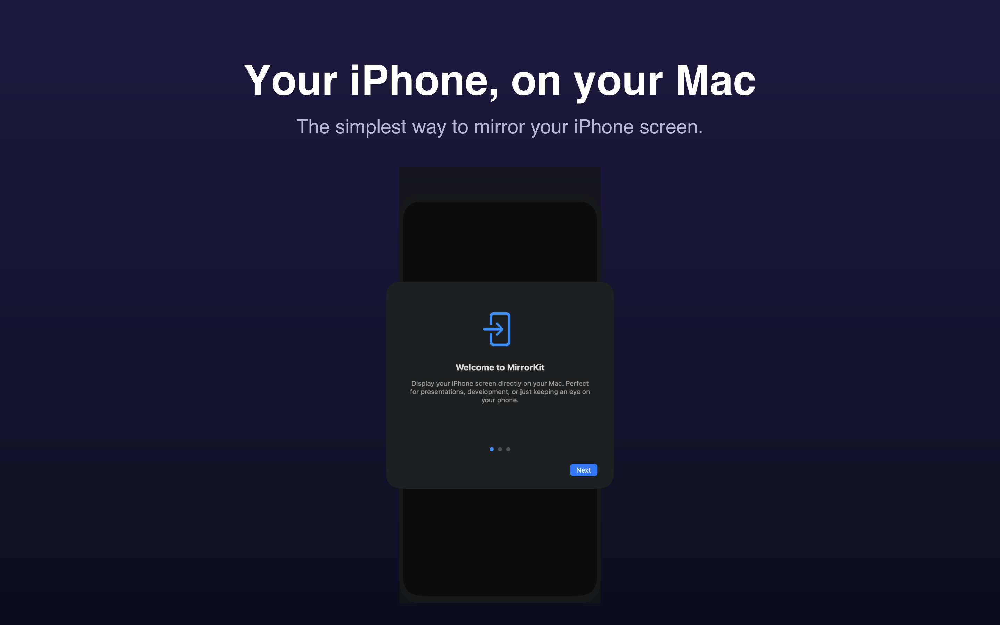
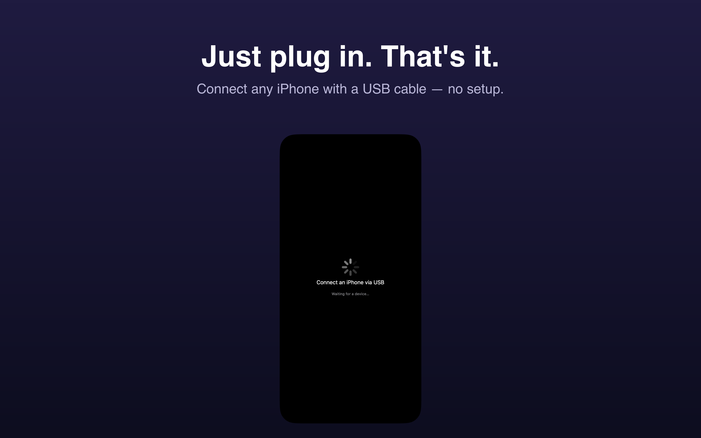
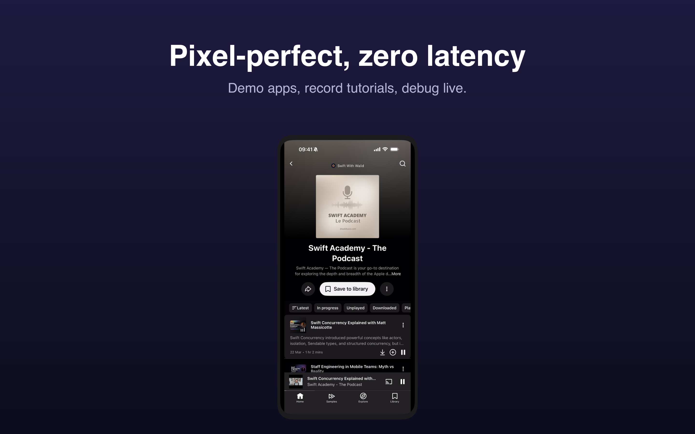
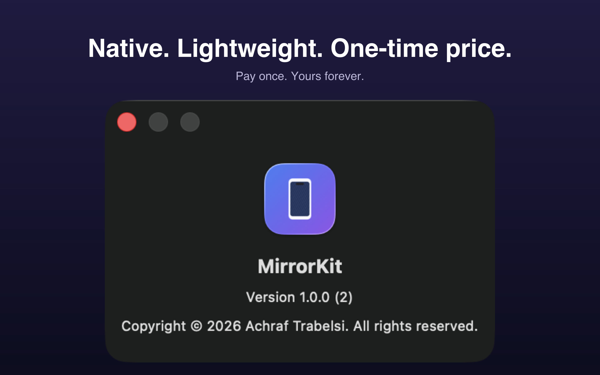

<div align="center">

# MirrorKit

**Mirror your iPhone screen on your Mac in real time over USB.**

A native macOS app built with SwiftUI + AppKit. No Wi-Fi, no AirPlay, no lag.
Powered by the same CoreMediaIO + AVFoundation pipeline as QuickTime Player.




</div>

---

## Features

- **Real-time mirroring over USB** — sub-frame latency, no Wi-Fi dependency
- **Authentic iPhone device frame** with Dynamic Island for the latest models
- **Fullscreen mode** with a beautiful gradient background, perfect for presentations
- **Always-on-top toggle** to keep your iPhone visible while you work
- **Floating toolbar** that fades in on hover and stays out of your way
- **Menu bar status item** for quick access and shortcuts
- **Native and lightweight** — under 5 MB, instant launch, low CPU
- **Privacy first** — runs 100% locally, zero network activity, zero analytics

## Screenshots

<table>
  <tr>
    <td></td>
    <td></td>
  </tr>
  <tr>
    <td></td>
    <td></td>
  </tr>
  <tr>
    <td></td>
    <td></td>
  </tr>
</table>

## How it works

When an iPhone is connected via USB, macOS exposes its screen as an external `AVCaptureDevice` — exactly the same mechanism QuickTime Player uses for iOS screen recording. MirrorKit:

1. Enables `kCMIOHardwarePropertyAllowScreenCaptureDevices` via CoreMediaIO at launch
2. Discovers the iPhone via `AVCaptureDevice.DiscoverySession` (`.external`, `.muxed`)
3. Captures the video stream through `AVCaptureSession` + `AVCaptureVideoDataOutput`
4. Renders frames into a `CALayer` inside a borderless `NSWindow` with the aspect ratio locked to the device resolution
5. Wraps the video in a SwiftUI device frame styled per detected iPhone model

```
iPhone (USB)
   │
   ▼
 usbmuxd ──► CoreMediaIO ──► AVCaptureDevice (.external, .muxed)
                                       │
                                       ▼
                              AVCaptureSession
                                       │
                                       ▼
                         AVCaptureVideoDataOutput
                                       │
                                       ▼
                       VideoDisplayLayer (CALayer)
                                       │
                                       ▼
                          DeviceFrameView (SwiftUI)
```

## Project structure

```
MirrorKit/
├── MirrorKitApp.swift          # @main
├── AppDelegate.swift           # CoreMediaIO setup, status item, main menu
├── Info.plist                  # Bundle metadata, NSCameraUsageDescription
├── MirrorKit.entitlements      # App Sandbox + camera + USB
├── Core/
│   ├── DeviceManager.swift     # @Observable iPhone discovery
│   ├── CaptureEngine.swift     # Actor wrapping AVCaptureSession
│   └── FrameRenderer.swift     # NSViewRepresentable + VideoDisplayLayer
├── UI/
│   ├── MirrorWindowController.swift
│   ├── MirrorContentView.swift
│   ├── DeviceFrameView.swift
│   ├── FloatingToolbar.swift
│   ├── OnboardingView.swift
│   ├── AboutView.swift
│   └── DevicePickerView.swift
├── Models/
│   ├── ConnectedDevice.swift
│   └── CaptureState.swift
└── Utils/
    └── DeviceFrameProvider.swift
```

## Build

Requirements:
- macOS 14.0+ (Sonoma)
- Xcode 16+
- `xcodegen` (`brew install xcodegen`)

```bash
xcodegen generate
xcodebuild -project MirrorKit.xcodeproj -scheme MirrorKit -configuration Debug build
open ~/Library/Developer/Xcode/DerivedData/MirrorKit-*/Build/Products/Debug/MirrorKit.app
```

Or open `MirrorKit.xcodeproj` in Xcode and press ⌘R.

## Tech stack

- **Swift 5.9** with `@Observable`, `actor`, `async/await`
- **SwiftUI** for views, **AppKit** for the borderless window and status item
- **CoreMediaIO** for iOS device exposure
- **AVFoundation** for the capture pipeline
- **CoreVideo / CoreImage** for frame rendering
- **xcodegen** for project file generation
- **100% Apple frameworks**, zero third-party dependencies

## Distribution

MirrorKit is available on the **Mac App Store** for €9.99 (one-time purchase).
The submission kit (description, screenshots, privacy policy) lives in [`AppStore/`](AppStore/).

## Privacy

MirrorKit collects nothing. The video stream from your iPhone never leaves your Mac. No analytics, no telemetry, no network calls. See the [Privacy Policy](https://trabelsiachraf.github.io/mirrorkit-site/privacy.html).

## Author

Built by [Achraf Trabelsi](https://github.com/TrabelsiAchraf) · 2026

For support: [trabelsiachraf.devapps@gmail.com](mailto:trabelsiachraf.devapps@gmail.com)
